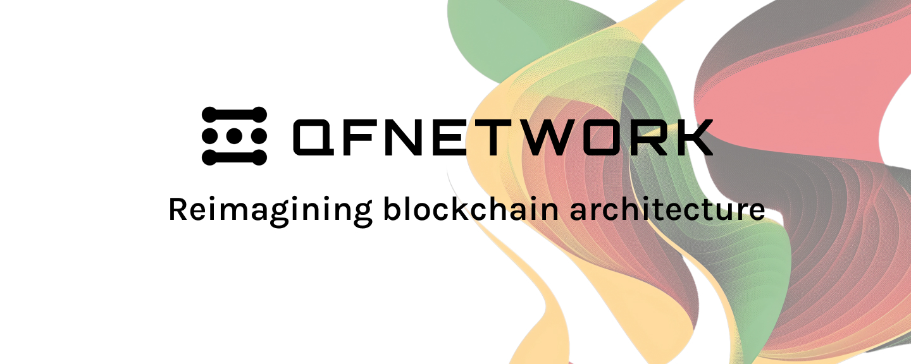

<div align="center">



# Quantum Fusion

[](https://github.com/QuantumFusion-network/qf-solochain/blob/main/LICENSE)
<br>


<br>
[](https://x.com/QuantumFusion_)

</div>

For contributing to this project, please read [Contributing](#contributing) section.

## Building From Source

> This section assumes that the developer is running on either macOS or Debian-variant operating system. For Windows,
although there are ways to run it, we recommend using [WSL](https://learn.microsoft.com/en-us/windows/wsl/install)
or a virtual machine.

1. Install Polkadot SDK dependencies following https://docs.polkadot.com/develop/parachains/install-polkadot-sdk/.
2. Clone the repository and build the node binary.

    ```console
    git clone --recursive https://github.com/QuantumFusion-network/qf-solochain.git
    cd qf-solochain
    cargo build --release
    ```

3. Inspect available subcommands.

    ```console
    ./target/release/qf-solochain --help
    ```

4. Run a local node in dev mode.

    ```bash
    make qf-run
    ```

## Executables and runtimes
### Main node executable and runtime
The main node executable is `qf-node` and the runtime is `qf-runtime`.

### Build the node binary
For building the fastchain node binary use 
```bash
cargo build -p qf-node
```

or for parachain node use

```bash
cargo build -p qf-parachain-node
```

### Make the chainspec
1. Define the path to the chainspec
```bash
export SPEC_PATH=./chainspecs   # or your own path
```

2. For building the chainspec use 
```bash
./target/debug/qf-node build-spec --disable-default-bootnode > $SPEC_PATH/fastchain-spec.json
```

Make the raw version of the spec 
```bash
./target/debug/qf-node build-spec --chain $SPEC_PATH/fastchain-spec.json --raw > $SPEC_PATH/fastchain-spec-raw.json
```

### Prepare the key for validator and collator modes
Not all nodes can generate the key as 
```bash
./target/debug/qf-node key generate-node-key
```
and you should build the `subkey` for generating keys by command 
```bash
cargo build -p subkey
```

1. You must create the folders in `data` for storing the keys by command 
```bash
mkdir -p $DATA_PATH/chains/$CHAIN_NAME/network
```
where 
- `DATA_PATH` - path to the data directory
- `CHAIN_NAME` - name of the chain ("local_testnet" for default)

2. After that you can generate the key as 

```bash
./target/debug/subkey generate-node-key > $DATA_PATH/chains/$CHAIN_NAME/network/secret_ed25519
```
where 
- `DATA_PATH` - path to the data directory
- `CHAIN_NAME` - name of the chain ("local_testnet" for default)

or

```bash
./target/debug/qf-node key generate-node-key > $DATA_PATH/chains/$CHAIN_NAME/network/secret_ed25519
```

### Run the fastchain node
- As full node (no need to generate the key)
```bash
./target/debug/qf-node --chain $SPEC_PATH/fastchain-spec-raw.json -d $DATA_PATH
```
- As validator (user Alice and need to generate the key)
```bash
./target/debug/qf-node --chain $SPEC_PATH/fastchain-spec-raw.json --validator --alice -d $DATA_PATH
```


Also you can specify the ports:
- `--port <port>` - port for the node
- `--rpc-port <port>` - port for the RPC

### Run the parachain node
Before run the parachain node you need to run the relaychain node.
For run the local relaychain you can customize and use this bash script:
```bash
#!/bin/bash

SPEC_PATH="../chain-specs"
DATA_PATH="../data-relay"
NODE="<pato to yoyr polkadot node>/polkadot"

mkdir -p $DATA_PATH

# polkadot \
$NODE \
--port 40340 \
--rpc-port 9950 \
-d $DATA_PATH \
--chain $SPEC_PATH/relaychain-spec-raw.json --alice
```

First generate the chainspec as for fastchain but by 
```bash
./target/debug/qf-parachain-node build-spec --disable-default-bootnode > $SPEC_PATH/parachain-spec.json
./target/debug/qf-parachain-node build-spec --chain $SPEC_PATH/parachain-spec.json --raw > $SPEC_PATH/parachain-spec-raw.json
```

- As full node (no need to generate the key)
```bash
./target/debug/qf-parachain-node --chain $SPEC_PATH/parachain-spec-raw.json -d $DATA_PATH -- --chain $SPEC_PATH/relaychain-spec-raw.json
```
- As collator (user Alice and need to generate the key)
```bash
./target/debug/qf-parachain-node --chain $SPEC_PATH/parachain-spec-raw.json --collator --alice -d $DATA_PATH -- --chain $SPEC_PATH/relaychain-spec-raw.json
```

## Run the Full Node

- To build and run a full node in a container please read instruction [docker/README.md](docker/README.md)
- Please notice a full node does register itself at [https://telemetry.qfnetwork.xyz/](https://telemetry.qfnetwork.xyz/).

## Testing with Zombienet

See [zombienet/README.md](zombienet/README.md).

## Compiling Smart Contracts for PolkaVM

First install build tools.

1. Install [Rust toolchain targeting RISC-V RV32E](https://github.com/paritytech/rustc-rv32e-toolchain).
1. Install [bun](https://bun.sh), npm, or yarn to use [Chopsticks](https://github.com/AcalaNetwork/chopsticks) to run
   the blockchain node.
1. Install polkatool[^1] (for relinking the standard RV32E ELF to a PolkaVM blob) and chain-spec-builder[^2](for building
   the chain spec from a wasm).

    ```console
    make tools
    ```

To compile a program, run `make pvm-prog-<progname>` where `<progname>` is the name of the program to be compiled. For
example, `make pvm-prog-calc`. The `.polkavm` file will be generated in `output/`.

After that you can use the `make run` to run the node. Then go to UI Polkadot.js and call the extrinsic `qfPolkaVM`.
Then run functions:

- `upload(programBlob)` and upload the `.polkavm` blob
- `execute(a, b, op)` with the two numbers (`a`, `b`) you want to calculate and select the type of operation `op` with 0
- sum, 1 - sub, 2 - mul.

NOTE - you can use the precompiled `qf-pvm-calc.polkavm` blob to test the node. You can find it in the `pvm_prog/precompiled_examples`
folder.

### Testing

For testing compiled polkavm binary blobs use the [qf-test-runner/README.md](qf-test-runner/README.md)

### Troubleshooting

If your compiled `.polkavm` file is not working, try to run `make tools` again that reinstall the tools with `polkatool`
for actual version.

For any compilation errors try to run `make clean` or `rm -rf target` and then try again.

## Makefile commands

- Build the node: `make qf-node`
- Build the release node: `make qf-node-release`
- Build the node and run it: `make qf-run`
- Build the node and run it with wasm file from `output`: `make qf-run-wasm`
- Build the runtime: `make qf-runtime`
- Build the pallet: `make polkavm-pallet`
- Linting: `make clippy`
- Formatting: `make fmt`
- Run tests: `make qf-test`
- Check all: `make check`
- Make chain spec: `make qf-chainspec`
- Make PolkaVM blob: `make pvm-prog-<progname>` where `<progname>` is the name of the program to be compiled. For example
  `make pvm-prog-calc`
- Test the compiled `.polkavm` blob: `make test-pvm-prog-<progname>` where `<progname>` is the name of the compiled
  program. For example `make test-pvm-prog-calc`

## Contributing

We welcome contributions of all kinds! Whether you're reporting or fixing a bug, adding a feature, or improving
documentation, your help is greatly appreciated. For a bug or vulnerability report please [open a new issue](https://github.com/QuantumFusion-network/qf-solochain/issues/new).

For code contributions please follow these steps:

1. Fork the repository and create a new branch following the format `your-github-name/descriptive-branch-name` (e.g., `alice/fix-123`).
2. Make smaller commits with clear messages to simplify reviewer's work.
3. Submit a pull request targeting `main` branch and provide a concise description of your changes.

By contributing, you agree to adhere to our [Contributor Covenant Code of Conduct](./CODE_OF_CONDUCT.md), which fosters
a respectful and inclusive environment.

We appreciate your support and look forward to your contributions! 🚀

[^1]: <https://forum.polkadot.network/t/announcing-polkavm-a-new-risc-v-based-vm-for-smart-contracts-and-possibly-more/3811#the-compilation-pipeline-7> "The compilation pipeline".
[^2]: <https://github.com/paritytech/polkadot-sdk/tree/master/substrate/bin/utils/chain-spec-builder> "chain-spec-builder".
